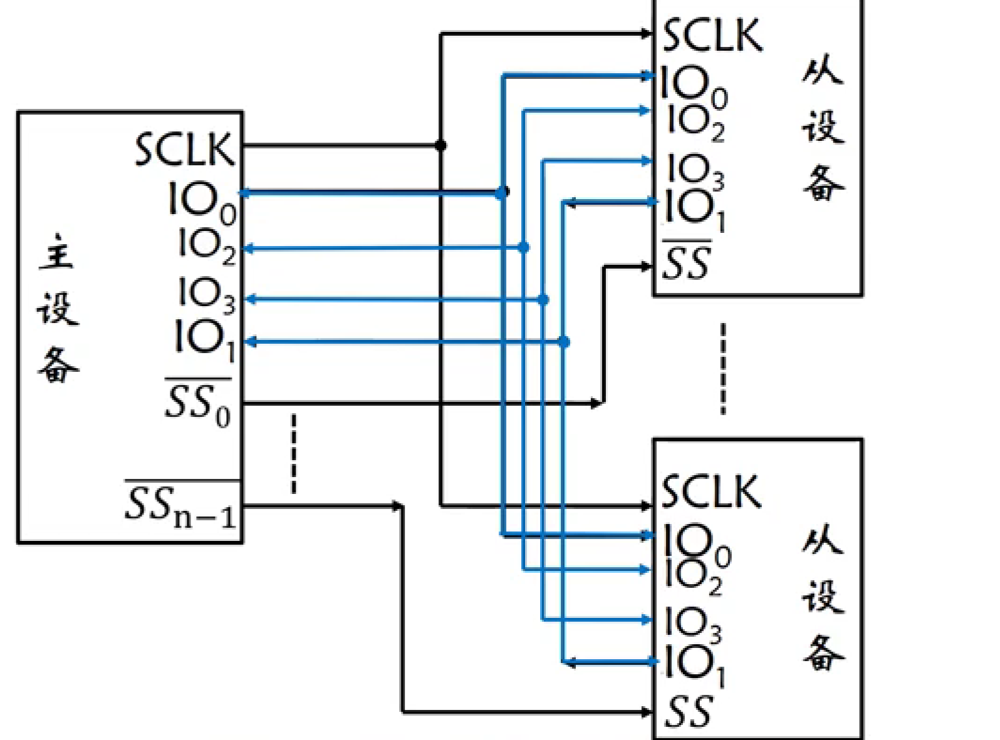
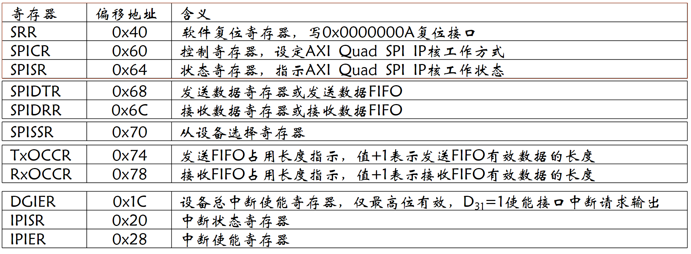
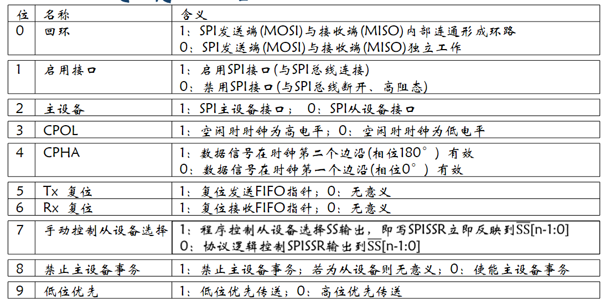
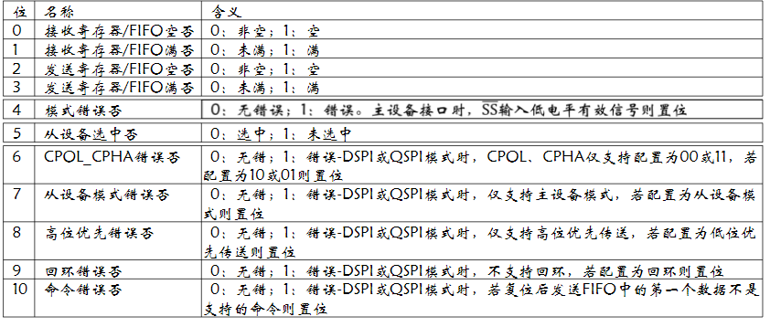
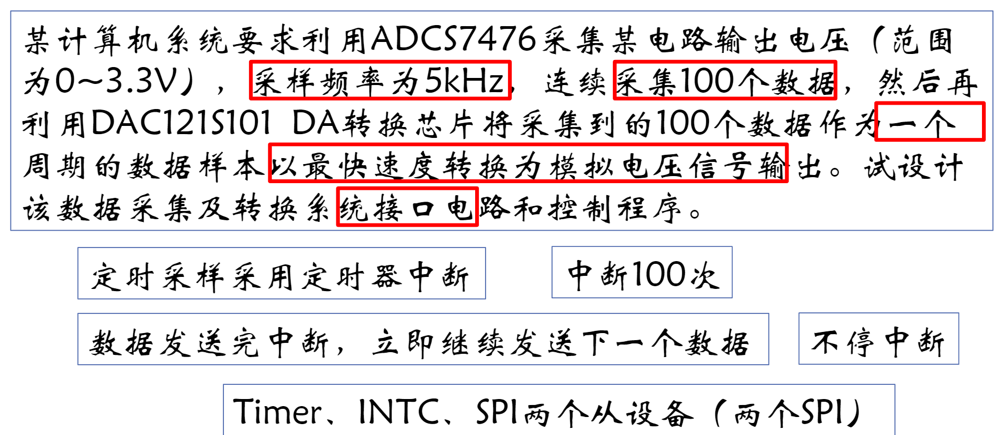
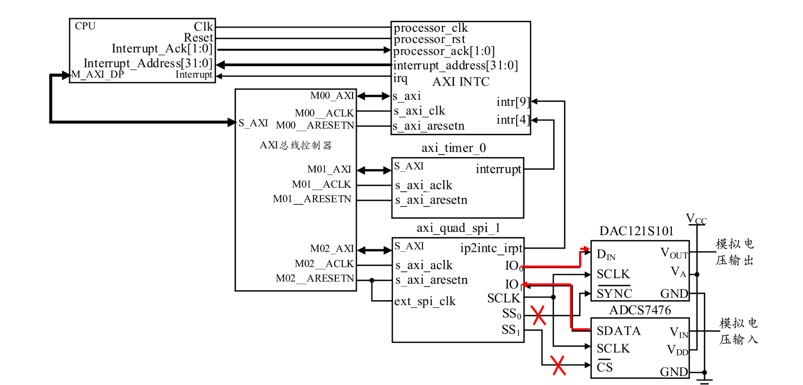
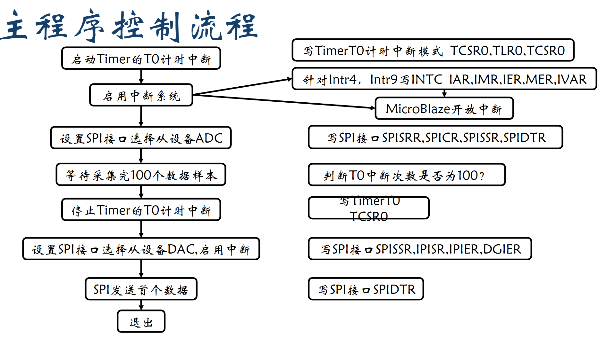
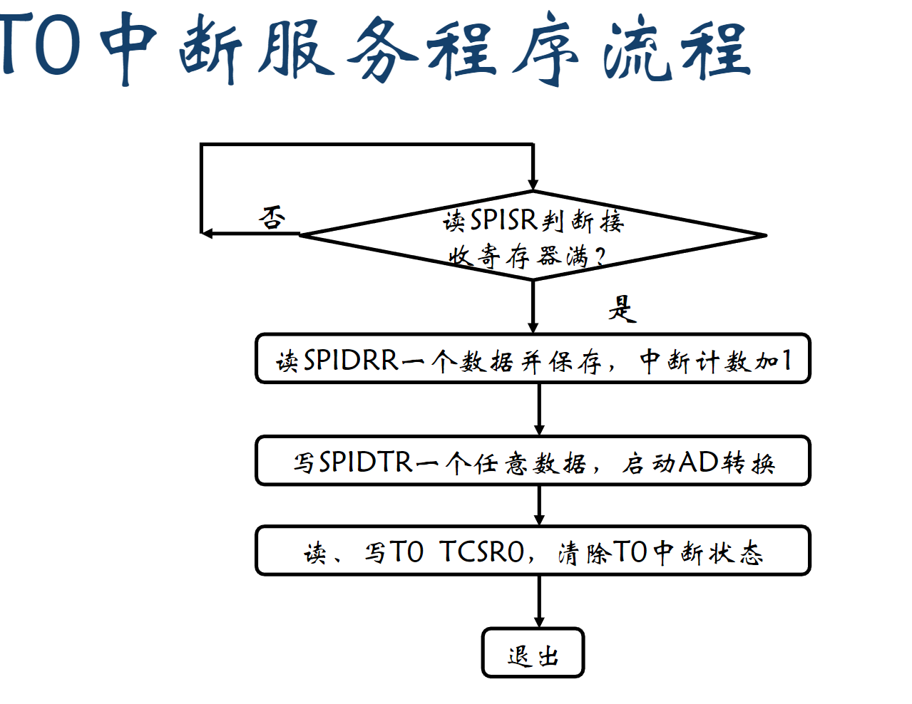
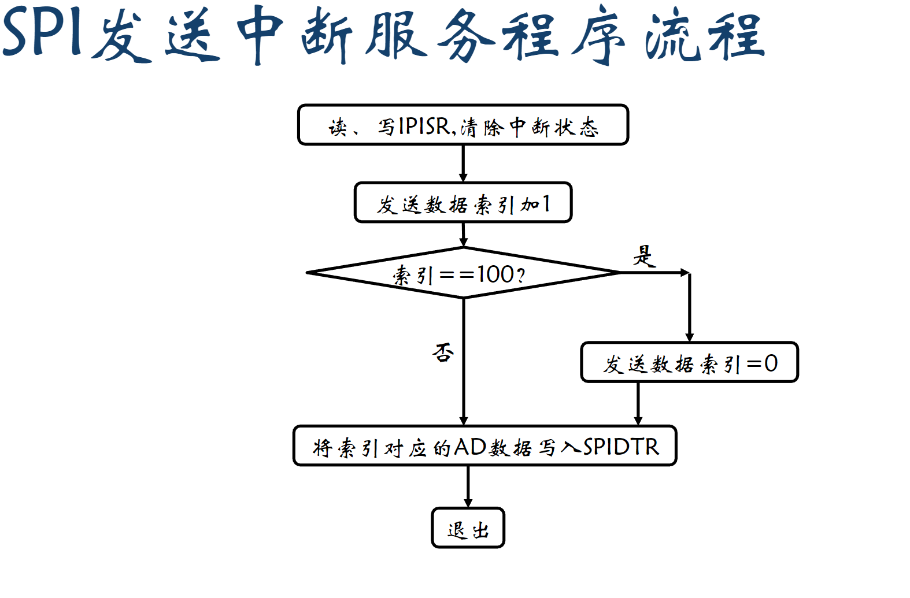

## SPI总线接口中断

### SPI接口工作原理



#### AXI Quad SPI IP核简介


- `ext_spi_clk`外部时钟输入
- `SCLK`内部时钟产生并且对外输出
- `ip2intc_irpt`中断控制信号源

#### SPI接口寄存器存储影像



具体的各个寄存器解释如下所示:

- `SPICR`存储器



- `SPISR`寄存器



- `IPISR\IER`寄存器


#### `SPI`主从设备接口中断方式控制程序流程

- 中断初始化
  - 写`SPISSR`复位`SPI`接口
  - 写`SPICR`设置`SPI`接口工作模式
  - 写`SPISSR`选择通信从设备
  - 写`IPISR`清除原中断状态 
  - 写`IPIER\DGIER`使能中断源 
  - 写`SPIDTR`发送数据，`SPI`总线全双工通信，触发中断源 
- 中断服务
  - 读、写`IPISR`清除中断状态 
  - 读`SPIDRR`获取接收的数据 
  - 写`SPIDTR`发送下一个数据，触发下一次中断 

### 应用示例



#### 接口示例



#### 各部件程序控制流程







#### 完整代码

##### 快速中断

```c
#include "xparameters.h"
#include "xtmrctr_l.h"
#include "xspi_l.h"
#include "xintc_l.h"
#include "xil_io.h"
#include "xil_exception.h"
#define RESET_VALUE 2000-2
void T0Handler() __attribute__((fast_interrupt));
void SPIHandler() __attribute__((fast_interrupt));
short samples[100];
int int_times=0;
int main()
{	
    int status;
	status=Xil_In32(XPAR_TMRCTR_0_BASEADDR+XTC_TCSR_OFFSET);
	status=status&(~XTC_CSR_ENABLE_TMR_MASK);
	Xil_Out32(XPAR_TMRCTR_0_BASEADDR+XTC_TCSR_OFFSET,status);
	Xil_Out32(XPAR_TMRCTR_0_BASEADDR+XTC_TLR_OFFSET,RESET_VALUE);
	Xil_Out32(XPAR_TMRCTR_0_BASEADDR+XTC_TCSR_OFFSET,status|XTC_CSR_LOAD_MASK);
	Xil_Out32(XPAR_TMRCTR_0_BASEADDR+XTC_TCSR_OFFSET,status|
			XTC_CSR_INT_OCCURED_MASK|XTC_CSR_AUTO_RELOAD_MASK
			|XTC_CSR_DOWN_COUNT_MASK|XTC_CSR_ENABLE_INT_MASK|
			XTC_CSR_ENABLE_TMR_MASK);
	Xil_Out32(XPAR_INTC_0_BASEADDR+XIN_ISR_OFFSET,  
                          Xil_In32(XPAR_INTC_0_BASEADDR+XIN_ISR_OFFSET));
	Xil_Out32(XPAR_INTC_0_BASEADDR+XIN_IER_OFFSET,  
                  XPAR_AXI_TIMER_0_INTERRUPT_MASK|XPAR_AXI_QUAD_SPI_1_IP2INTC_IRPT_MASK);
	Xil_Out32(XPAR_INTC_0_BASEADDR+XIN_IMR_OFFSET, 
                        XPAR_AXI_TIMER_0_INTERRUPT_MASK|XPAR_AXI_QUAD_SPI_1_IP2INTC_IRPT_MASK);
	Xil_Out32(XPAR_INTC_0_BASEADDR+XIN_MER_OFFSET,
                       XIN_INT_MASTER_ENABLE_MASK|XIN_INT_HARDWARE_ENABLE_MASK);
    Xil_Out32(XPAR_INTC_0_BASEADDR+XIN_IVAR_OFFSET+4*XPAR_INTC_0_TMRCTR_0_VEC_ID,(int)T0Handler);
	Xil_Out32(XPAR_INTC_0_BASEADDR+XIN_IVAR_OFFSET+4*XPAR_INTC_0_SPI_1_VEC_ID,(int)SPIHandler);
	microblaze_enable_interrupts();
 	Xil_Out32(XPAR_SPI_1_BASEADDR+XSP_SRR_OFFSET,XSP_SRR_RESET_MASK);
	Xil_Out32(XPAR_SPI_1_BASEADDR+XSP_CR_OFFSET,XSP_CR_ENABLE_MASK|
			XSP_CR_MASTER_MODE_MASK|XSP_CR_CLK_POLARITY_MASK
			|XSP_CR_TXFIFO_RESET_MASK|XSP_CR_RXFIFO_RESET_MASK);
	Xil_Out32(XPAR_SPI_1_BASEADDR+XSP_SSR_OFFSET,0x1);
 	Xil_Out32(XPAR_SPI_1_BASEADDR+XSP_DTR_OFFSET,0x0);
 	while(int_times<100);
 	status=Xil_In32(XPAR_TMRCTR_0_BASEADDR+XTC_TCSR_OFFSET);
	status=status&(~XTC_CSR_ENABLE_TMR_MASK);
	Xil_Out32(XPAR_TMRCTR_0_BASEADDR+XTC_TCSR_OFFSET,status);
 	Xil_Out32(XPAR_SPI_1_BASEADDR+XSP_SSR_OFFSET,0x2);
 	Xil_Out32(XPAR_SPI_1_BASEADDR+XSP_IISR_OFFSET,
			Xil_In32(XPAR_SPI_1_BASEADDR+XSP_IISR_OFFSET));
	Xil_Out32(XPAR_SPI_1_BASEADDR+XSP_IIER_OFFSET,
			XSP_INTR_TX_EMPTY_MASK);
	Xil_Out32(XPAR_SPI_1_BASEADDR+XSP_DGIER_OFFSET,
			XSP_GINTR_ENABLE_MASK);
 	int_times=0;
	Xil_Out32(XPAR_SPI_1_BASEADDR+XSP_DTR_OFFSET,samples[int_times]);
	return 0;
}
void T0Handler(){
	while((Xil_In32(XPAR_SPI_1_BASEADDR+XSP_SR_OFFSET)&
				XSP_SR_RX_FULL_MASK)!=XSP_SR_RX_FULL_MASK);
	samples[int_times]=(short)(Xil_In32(XPAR_SPI_1_BASEADDR+XSP_DRR_OFFSET)&0xfff);
	int_times++;
	Xil_Out32(XPAR_SPI_1_BASEADDR+XSP_DTR_OFFSET,0x0);
	Xil_Out32(XPAR_TMRCTR_0_BASEADDR+XTC_TCSR_OFFSET,
			Xil_In32(XPAR_TMRCTR_0_BASEADDR+XTC_TCSR_OFFSET));
}
void SPIHandler(){
	Xil_Out32(XPAR_SPI_1_BASEADDR+XSP_IISR_OFFSET,
			Xil_In32(XPAR_SPI_1_BASEADDR+XSP_IISR_OFFSET));
	int_times++;
	if(int_times==100)
		int_times=0;
	Xil_Out32(XPAR_SPI_1_BASEADDR+XSP_DTR_OFFSET,samples[int_times]);
}
```

##### 普通中断

```c
#include "xparameters.h"
#include "xtmrctr_l.h"
#include "xspi_l.h"
#include "xintc_l.h"
#include "xil_io.h"
#include "xil_exception.h"
#define RESET_VALUE 2000-2
void T0Handler();
void SPIHandler();
short samples[100];
int int_times;
Void My_ISR __attribute__(interrupt_handler)
int main()
{	int status;
	status=Xil_In32(XPAR_TMRCTR_0_BASEADDR+XTC_TCSR_OFFSET);
	status=status&(~XTC_CSR_ENABLE_TMR_MASK);
	Xil_Out32(XPAR_TMRCTR_0_BASEADDR+XTC_TCSR_OFFSET,status);
	Xil_Out32(XPAR_TMRCTR_0_BASEADDR+XTC_TLR_OFFSET,RESET_VALUE);
	Xil_Out32(XPAR_TMRCTR_0_BASEADDR+XTC_TCSR_OFFSET,status|XTC_CSR_LOAD_MASK);
	Xil_Out32(XPAR_TMRCTR_0_BASEADDR+XTC_TCSR_OFFSET,status|
			XTC_CSR_INT_OCCURED_MASK|XTC_CSR_AUTO_RELOAD_MASK
			|XTC_CSR_DOWN_COUNT_MASK|XTC_CSR_ENABLE_INT_MASK|
			XTC_CSR_ENABLE_TMR_MASK);
	Xil_Out32(XPAR_INTC_0_BASEADDR+XIN_ISR_OFFSET,  
                          Xil_In32(XPAR_INTC_0_BASEADDR+XIN_ISR_OFFSET));
	Xil_Out32(XPAR_INTC_0_BASEADDR+XIN_IER_OFFSET,  
                  XPAR_AXI_TIMER_0_INTERRUPT_MASK|XPAR_AXI_QUAD_SPI_1_IP2INTC_IRPT_MASK);
	Xil_Out32(XPAR_INTC_0_BASEADDR+XIN_IMR_OFFSET, 
                        XPAR_AXI_TIMER_0_INTERRUPT_MASK|XPAR_AXI_QUAD_SPI_1_IP2INTC_IRPT_MASK);
	Xil_Out32(XPAR_INTC_0_BASEADDR+XIN_MER_OFFSET,
                       XIN_INT_MASTER_ENABLE_MASK|XIN_INT_HARDWARE_ENABLE_MASK);
	microblaze_enable_interrupts();	
void My_ISR()
{
	int status;
	status=Xil_In32(XPAR_AXI_INTC_0_BASEADDR+XIN_ISR_OFFSET);//读取ISR
	if((status&XPAR_AXI_TIMER_0_INTERRUPT_MASK)==XPAR_AXI_TIMER_0_INTERRUPT_MASK)
		 T0Handler();
	if((status&XPAR_AXI_QUAD_SPI_1_IP2INTC_IRPT_MASK)==
                                          XPAR_AXI_QUAD_SPI_1_IP2INTC_IRPT_MASK)
		SPIHandler ();
	Xil_Out32(XPAR_AXI_INTC_0_BASEADDR+XIN_IAR_OFFSET,status);//写IAR
}
```

